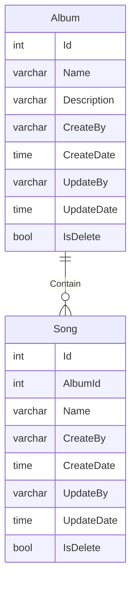

# This is my attempt at Clean architecture with existing album database.

## Following this guide. [Mikelopster|clean-code](https://docs.mikelopster.dev/c/goapi-essential/chapter-7/clean-code)

### Also add your own DB_DNS in .env.local for this to work.

Example: "DB_DSN=host=127.0.0.1 user=postgres password=postgres dbname=postgres port=5432 sslmode=disable"

### The database is as follow

